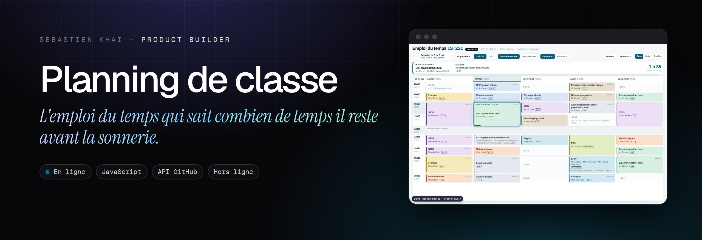
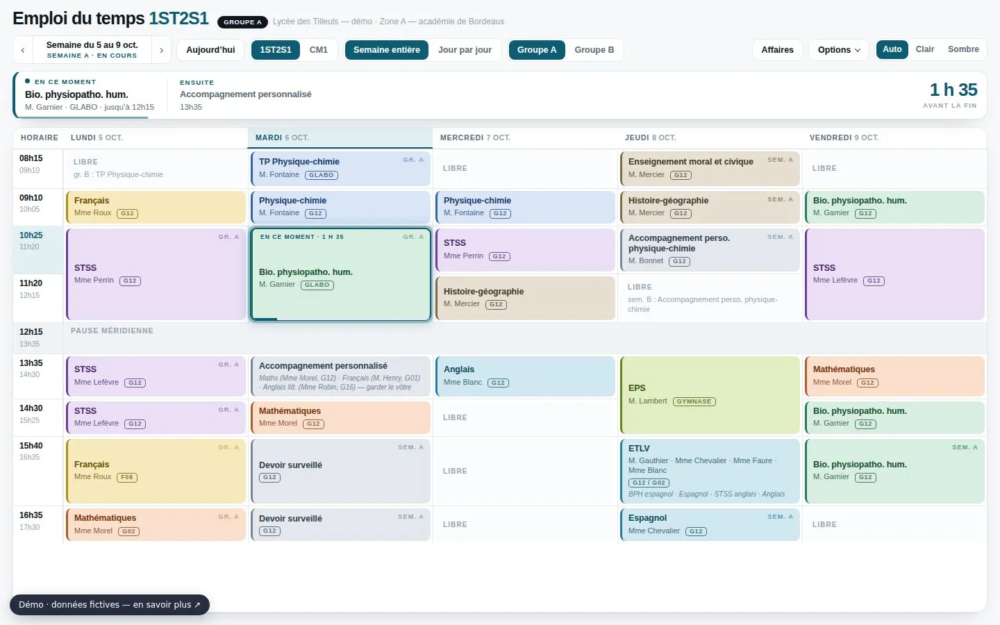
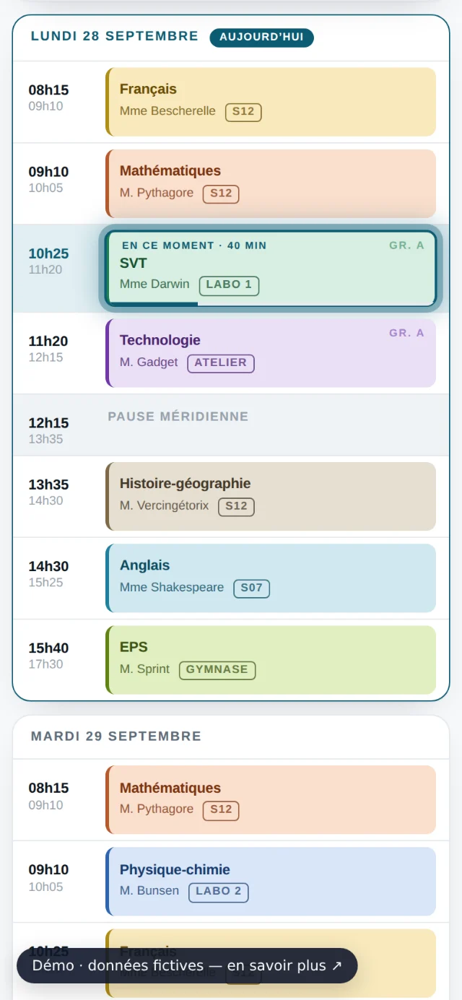

  
  
  

<h1 align="center">Planning de classe</h1>

<b>L'emploi du temps qui sait combien de temps il reste avant la sonnerie.</b> Un emploi du temps vivant pour élèves, parents et enseignants : le cours en cours, le suivant, le temps restant, les semaines A/B et les changements du jour.

---

### Le problème

Semaines A/B, groupes, salles qui changent, cours annulés : l'emploi du temps papier ne suit pas, et on ne sait jamais « on a quoi, là, et jusqu'à quand ? ».

### L'idée

Une page qui suit le vrai calendrier et répond d'un coup d'œil, avec un compte à rebours mis à jour chaque seconde.

### Comment c'est fait

Page statique sans dépendance. Deux types de plannings (créneaux fixes ou blocs horaires), vacances de la zone, changements ponctuels, affaires à préparer. Un mode modification publie sur GitHub : les autres appareils se mettent à jour d'eux-mêmes. Né d'un besoin familial, rendu générique.

**Outils** &nbsp; `JavaScript` `API GitHub` `Hors ligne`

### Aperçu

 

### Mentions

Établissement, classes et enseignants de la démo sont fictifs.

### English

**Planning de classe** — *The timetable that knows how long until the bell.* A living timetable for students, parents and teachers: the current class, the next one, time left, A/B weeks and today's changes.

A/B weeks, groups, changing rooms, cancelled classes: paper timetables can't keep up, and you never know “what do we have now, and until when?”. A page that follows the real calendar and answers at a glance, with a countdown updated every second. A dependency-free static page. Two kinds of timetables (fixed slots or time blocks), school holidays, one-off changes, things to bring. An edit mode publishes to GitHub: other devices update themselves. Born from a family need, made generic.

---

Conçu, développé et mis en ligne par <b>Sébastien Khai</b>, Product Builder · <a href="https://engob.github.io/portofolio/">portfolio</a> · <a href="https://engob.github.io/portofolio/projets/planning-classe/">fiche du projet</a> © 2026 Sébastien Khai — tous droits réservés.

<b>Documentation technique</b> · notes de développement et de mise en ligne

## Planning de classe — un emploi du temps vivant

Un emploi du temps qui sait quel jour on est : le cours en cours, le suivant, et **le temps
restant avant la sonnerie**, en gros. Pour élèves, parents et enseignants. Sans compte, sans
application à installer, sans serveur.

**Démo : https://engob.github.io/planning-classe/** (établissement, classes et professeurs fictifs).

### Ce que ça fait

- **Bandeau du moment** : cours en cours, suivant, compte à rebours avant la fin du cours,
  la reprise ou le prochain cours, mis à jour chaque seconde.
- **Semaines A / B** déduites du calendrier, **groupes A / B**, vacances et jours fériés de la zone.
- **Deux plannings dans une page** (ex. un lycéen et un écolier), avec bascule mémorisée :
  grille à créneaux fixes ou journées en blocs de durées variables.
- **Vue semaine** et **vue jour** pour le téléphone, thème clair / sombre.
- **Affaires à préparer** par matière et récapitulatif des enseignements.
- **Changements ponctuels** (cours annulé, salle changée, devoir) à une date précise, sans toucher à la grille.
- **Mode modification** puis **Publier sur GitHub** : un changement fait sur un appareil apparaît
  sur les autres en moins d'une minute.

### L'adapter

- `data.js` : le planning à créneaux (horaires, jours, cours, professeurs, salles, calendrier).
- `data-cm1.js` : le planning en blocs horaires.
- Ou directement dans la page : **Options → Mode modification**, puis **Publier** avec un jeton
  GitHub fine-grained limité au dépôt (*Contents : Read and write*), ou **Enregistrer** pour
  télécharger le fichier corrigé.

### Confidentialité

Les données restent dans le dépôt de la famille ou de l'enseignant. Le jeton GitHub reste dans le
navigateur et n'est jamais publié.

---

Conçu et développé par [Sébastien Khai](https://engob.github.io/portofolio/) — tous droits réservés.

